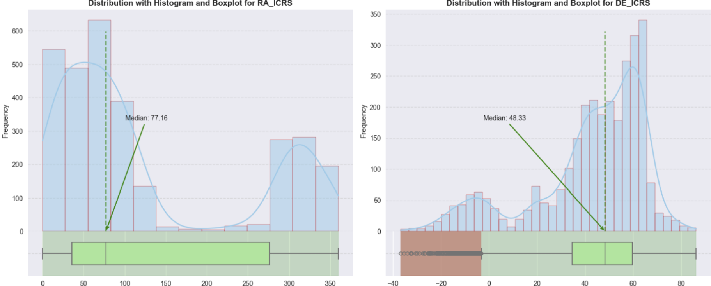
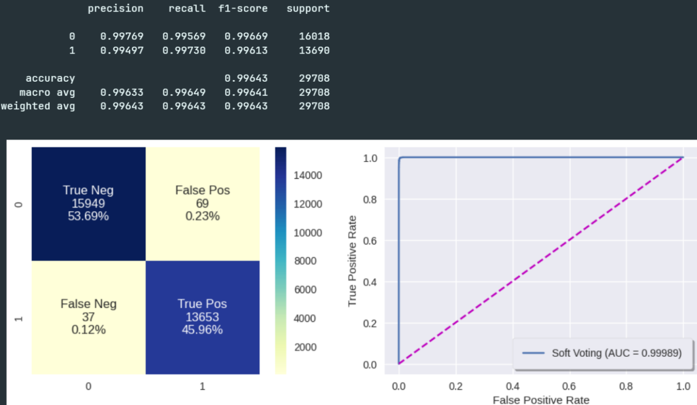

# **Gaia** Stellar Data Analytics

This repository contains my work for **2 assignments** in the **Fundamental of Data Analytics** subject at the **University of Technology Sydney** (UTS) taught by [Dr. Maoying Qiao](https://profiles.uts.edu.au/Maoying.Qiao). Each assignment is done using mostly [scikit-learn](https://scikit-learn.org/stable/) along with a `notebook` and a `pdf`, which includes a detailed explanation of the concepts and implementations involved, helping me achieve a perfect score of **100/100** for the subject.

## Scenario

A global space astrometry mission, **Gaia** is building the largest, most precise 3D map of our Galaxy by surveying nearly 2 billion objects. Throughout its mission, **Gaia** monitors each of its target stars about 14 times yearly. It precisely charts their positions, distances, movements, and changes in brightness. 

It is expected to discover hundreds of thousands of new celestial objects, such as extra-solar planets and brown dwarfs, and observe hundreds of thousands of asteroids within our own Solar System. The mission is also to study more than 1 million distant quasars and provide stringent new tests of Albert Einstein's General Theory of Relativity. 

In this project, the Head of the Analytics Unit asks you to use **Gaia** observation for **2-class** (`A`, `B`) stellar classification to help understand the Galaxy. As you will see, this dataset is highly complicated and includes many features that make this problem more challenging. Below are its attribute descriptions:

| **Variable**    | **Type**              | **Description**                                                                                                      |
|-----------------|-----------------------|----------------------------------------------------------------------------------------------------------------------|
| **RA_ICRS**     | *Quantitative, Interval* | *Right ascension* in the **ICRS** (International Celestial Reference System) coordinate system                             |
| **DE_ICRS**     | *Quantitative, Interval* | *Declination* in the **ICRS** coordinate system                                                                            |
| **Source**      | *Qualitative, Nominal*  | Unique identifier for an object in the **Gaia** catalogue                                                                |
| **Plx**         | *Quantitative, Ratio*   | Trigonometric **parallax** of the celestial body in milliarcseconds                                                      |
| **PM**          | *Quantitative, Ratio*   | Total proper motion of the celestial body in the sky in milliarcseconds per year                                     |
| **pmRA**        | *Quantitative, Ratio*   | Proper motion component in the *right ascension* direction in milliarcseconds per year                                 |
| **pmDE**        | *Quantitative, Ratio*   | Proper motion component in the *declination* direction in milliarcseconds per year                                     |
| **Gmag**, **BPmag**, **RPmag**, **GRVSmag** | *Quantitative, Interval* | Average apparent magnitude integrated into the `G` band, `BP` blue band, `RP` red band, and `RVS` band |
| **e_Gmag**, **e_BPmag**, **e_RPmag**, **e_GRVSmag** | *Quantitative, Ratio*   | Error in `G`, `BP`, `RP`, and `RVS` magnitude    |
| **BP-RP**, **BP-G**, **G-RP** | *Quantitative, Interval*| `BP-RP`, `BP-G`, and `G-RP` color index  |
| **pscol**       | *Quantitative, Ratio*   | pseudocolor estimated by **Gaia** in um^-1                                                                               |
| **Teff**        | *Quantitative, Ratio*   | Estimated effective temperature of the celestial object by **Gaia** in Kelvins                                           |
| **Dist**        | *Quantitative, Ratio*   | Distance to the celestial object inverse of the **parallax**, in parsecs                                                 |
| **Rad**         | *Quantitative, Ratio*   | Object radius estimate in terms of solar radius                                                                      |
| **Lum-Flame**   | *Quantitative, Ratio*   | Estimated object luminosity in terms of solar luminosity                                                             |
| **Mass-Flame**  | *Quantitative, Ratio*   | Mass estimate in terms of solar mass                                                                                 |
| **Age-Flame**   | *Quantitative, Ratio*   | Celestial object age in giga years   |
| **z-Flame**     | *Quantitative, Ratio*   | Redshift in km/s |
| **`SpType-ELS`**  | *Qualitative, Nominal*  | Estimated spectral class by **Gaia**                                                                                     |

## [Assignment 1](./data_exploration/): Data Exploration and Visualisation

> A thorough exploration of the dataset, identifying and characterizing outliers, clusters of data points, and potential attributes with well-chosen visualizations (including clear descriptions and interpretation). 

1️⃣ Identify the attribute type (*qualitative*, *discreet*/*continuous* *quantitative*, *nominal*, *ordinal*, *interval*, *ratio*) of each attribute in the dataset

2️⃣ For every attribute, analyze the values of the summarizing properties by thoroughly analyzing the *frequency*, *location*, and *spread*: means, medians, variances, percentiles, value ranges of the attributes, frequency tables of values, distributions, ...

3️⃣ Based on the above summary statistics, conduct a more in-depth attribute analysis by applying proper visualizations for the corresponding statistics:
- Give convincing explanation for your choice of attributes to work with or visualize.
- Next, analyze the Frequency distributions with *pie*/*bar* charts.
- Finally, analyze any **outliers** with *boxplots*. 

4️⃣ Explore multiple attributes' relationships of the dataset and include explanations of what has been identified:
- Analyze noticeable distributions and relationships from the [pairplot](https://seaborn.pydata.org/generated/seaborn.pairplot.html). 
- Analyze all noticeable values from the **correlation matrix**, from the strongest to weakest.
- Identify **interesting** and potential attributes, and specific values of those attributes.

5️⃣ Apply *Equi-width* (Equal-interval) and *Equi-depth* (Equal-frequency) binning techniques using [`pd.cut`](https://pandas.pydata.org/docs/reference/api/pandas.cut.html) to smooth the values of **RA_ICRS** and **DE_ICRS** by bin means/boundaries

👉 Check the [fda_a2.ipynb](./data_exploration/fda_a2.ipynb) notebook and the [fda_a2.pdf](./data_exploration/fda_a2.pdf) report for more details.

## [Assignment 2](./stellar_classification/): Data Preprocessing and Stellar Classification

> A practical data analytics project that follows on from the data exploration in [Assignment 1](#assignment-1-data-exploration-and-visualisation). Here, you will make a correct prediction on the dataset after employing a sophisticated process of exploring the problem very thoroughly, preprocessing the data, looking at different methods, choosing their best parameters settings, and identifying the best classifier in a principled and explainable way.

1️⃣ Data preprocessing and transformations:

- Remove unecessary columns like `Unnamed` or `Source` columns and **Binarize** the target column.
- Remove missing values or fill them with [`KNNImputer`](https://scikit-learn.org/stable/modules/generated/sklearn.impute.KNNImputer.html). 
- Handle **outliers** with *winsorizing*.
- Apply **PCA** retaining to group some highly correlated columns. 
- Apply Scaling methods like [`StandardScaler`](https://scikit-learn.org/stable/modules/generated/sklearn.preprocessing.StandardScaler.html).

2️⃣ Cross-validation on Base Classifiers for Initial Testing:
- Select the Evaluation Metrics: *accuracy*, *precision*, *recall*, *f1-score*, *confusion matrix*, and *ROC-AUC*.
- Identify a range of suitable models for the classification task, perform initial **cross-validation**, and select the most promising based on initial testing.
- Make selections based on the performance (`train_score`, `test_score`, `fit_time`, overfitting, underfitting, etc.). 
- Use [`StratifiedKFold`](https://scikit-learn.org/stable/modules/generated/sklearn.model_selection.StratifiedKFold.html) **cross-validation** with **5** folds here to robustly evaluate model performance, helping to avoid overfitting and ensuring the model generalizes well to new data.

3️⃣ Hyperparameter Tuning of Potential Classifiers:
- Efficiently train models using [`HalvingRandomSearchCV`](https://scikit-learn.org/stable/modules/generated/sklearn.model_selection.HalvingRandomSearchCV.html) to find the best parameters for potential classifiers that yield the most accurate predictions, focusing on the `f1-score` as the evaluation metric.
- Integrate [`StratifiedKFold`](https://scikit-learn.org/stable/modules/generated/sklearn.model_selection.StratifiedKFold.html) **cross-validation** in the tuning process to ensure the model's performance is reliable and generalizes well to unseen data.

4️⃣ Evaluation for Best Estimator from Each Search:
- Plot the **cross-validation** results (with `mean f1-score`) of each search to check for overfitting and underfitting
- Utilize a range of metrics from step 1️⃣ to thoroughly evaluate model performance on the test set.

5️⃣ Further Improvement with [Soft Voting](https://scikit-learn.org/stable/modules/ensemble.html#weighted-average-probabilities-soft-voting):

- Once the best parameters for each classifier are identified, set up a [`VotingClassifier`](https://scikit-learn.org/stable/modules/generated/sklearn.ensemble.VotingClassifier.html) with the individually optimized classifiers.
- [Soft voting](https://scikit-learn.org/stable/modules/ensemble.html#weighted-average-probabilities-soft-voting) to predict class labels based on the average of probabilities given to that class by each base classifier. 
- Define a new grid for the [`VotingClassifier`](https://scikit-learn.org/stable/modules/generated/sklearn.ensemble.VotingClassifier.html), including varying the weights assigned to each classifier in a [Soft Voting](https://scikit-learn.org/stable/modules/ensemble.html#weighted-average-probabilities-soft-voting) scenario.
- Conduct a grid search over this new parameter space to fine-tune the ensemble. Ensure that the `f1-score` remains the criterion for optimization.
- Apply the same Interpretation and Evaluation in step 4️⃣ for the [`VotingClassifier`](https://scikit-learn.org/stable/modules/generated/sklearn.ensemble.VotingClassifier.html).

6️⃣ Make predictions on the unknown dataset using the best model and the same preprocessing process for the training data.

👉 Check the [fda_a3.ipynb](./stellar_classification/fda_a3.ipynb) notebook and the [fda_a3.pdf](./stellar_classification/fda_a3.pdf) report for more details.

